# U16A2 Design Phase

## Task log

### Design Phase:

- Each problem in the portfolio must have a definition statement

This will be done by 15/05/24

- Outline data storage requirements using a data dictionary, this will also outline data structures.

This will be done by the 18/05/24

- Create potential designs for the algorithm I am making, this will be done with pseudocode and flowcharts/use case diagrams.

This will be done by the 23/05/24

- Create a mockup of the GUI design for both problems.

This will be done by the 26/05/24

### Development Phase:

- Create the program for both problems

This will be done by the 03/06/24

- Implement test plans to ensure both programs will work as expected and to improve if they don't.

This will be done by the 05/06/24

- Carry out these tests on both of the programs.

This will be done by the 07/06/24

### Evaluation Phase:

- Review the design and gather feedback from others.

This will be done by the 08/06/24

- Optimize the programs based off the user feedback and review.

This will be done by the 10/06/24

- Evaluate the two programs.

This will be done by the 11/06/24

## Definition Statement

Here is an explanation of both problems.

### Problem 1

Problem one is a todo list, the program I am creating for this is primarily intended to demonstrate GUI. The GUI can either be implemented as a desktop native app with the use of WPF or it can be implemented using HTML/CSS in the presentation layer. The requirements of this todo list are the following:

- Creation and deletion of tasks.

- Tracking done state

- Supporting title, description, due date, completed with description and due date being mutable.

- Displaying a list of tasks.

- Be able to toggle whether all tasks or only incomplete tasks are displayed.

### Problem 2 

The college library needs to add all of its books to a new index system. Here I must provide a solution that is able to automatically read book details such as the title, author, publisher and publication date from a stored CSV file. There also has to be a separate class that is used for allocating the serial numbers through the implementation of an interface, this method will allow alternative implementations later on. The requirements of this index system are the following:

- Ability to read book details (title, author, publisher and publication date).

- Write the new details to a stored CSV file.

- Implemented interface to allow alternative implementations later.

- A separate class which allocates the serial numbers.

## Data Dictionary

### Problem 1

#### Libraries:

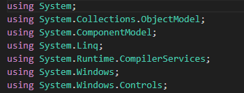

These libraries will have the benefit of reducing the amount of code I will have to write since they will provide reusable classes which I can call upon any time within the program. This will help with the todo list since these libraries will provide a variety of methods for managing the todo list such as LINQ queries, data collections and controls for the user interface.

#### Event Handlers: 

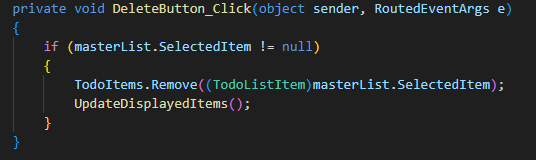

Here is an event handler that I plan on using in my code, event handlers will manage the user interactions whether that be pressing a button to either add, delete or edit task. Here we can see an event handler for the delete button and it uses an if statement to remove tasks and update displayed items whenever the user clicks the delete button.

#### Data Structure:

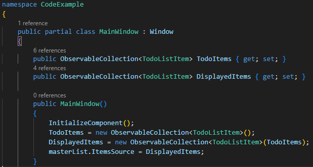

Here is an example of a data structure that I plan to use in my code, implementing data structures into the code will grant the benefit of bringing together data elements to facilitate their effective uses and sharing of data. They will provide a model on how the data elements will be organized in the program.

### Problem 2

#### Libraries: 

.png>)

Here are the libraries I will be using for problem two, there are a number of libraries here that will help with the reading and writing of CSV files. For example, the system.io library contains types which allow the reading and writing of files and provide directory support.

#### Data Storage:

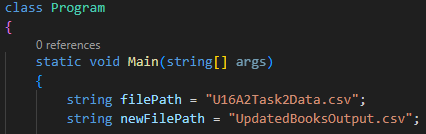

Here is some code which is an example of data storage, obviously I plan to use this in my code. The codes purpose here is that it reads the data in the original CSV file called "U16A2TaskData.csv" and it creates and stores the output data in the new CSV file called "UpdatedBooksOutput.csv".

#### Control Structure:

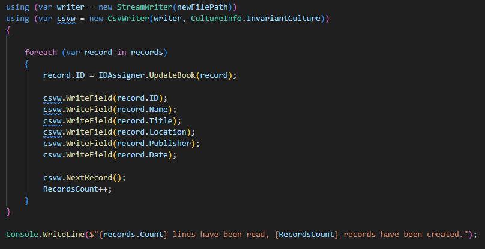

Here is an example of control structures being used which I will also be using in my code. Here the code is assigning each book detail to every book and is also assigning the serial code to each one until every book has gone through this process. This is an example of code iteration since this process of assigning books different book details and codes is iterated until all books have gone through this. The program will then output these details and also inform the user on how many records have been created.

## Use Case Diagrams

### Problem 1 Diagram:

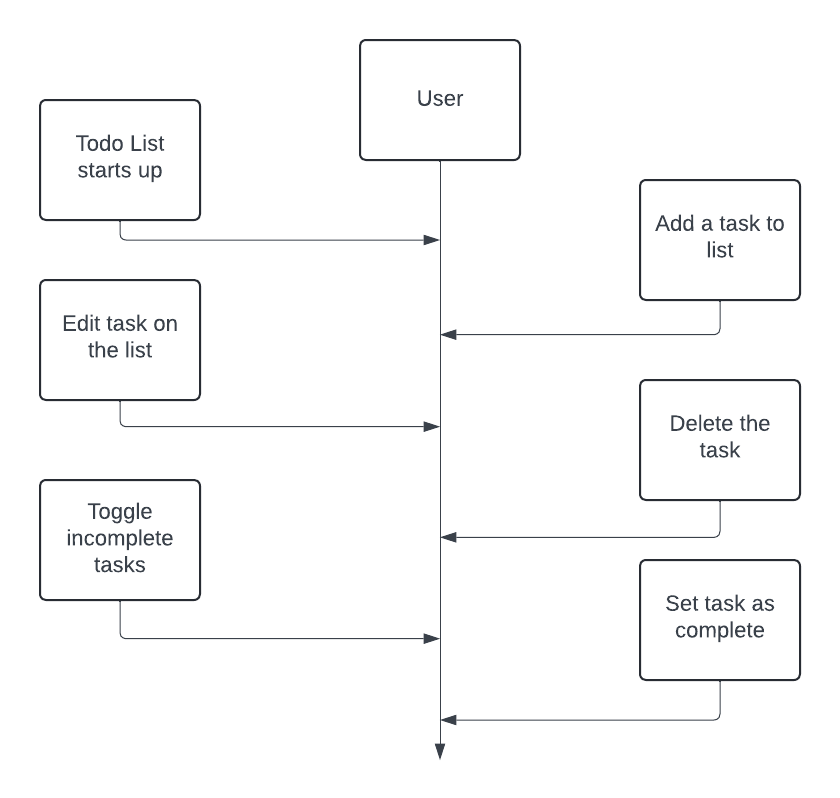

Here is the use case diagram for the todo list, as we can see it includes every main feature and option the list and GUI will include, all of these can be done by the user allowing them to edit the todo list the way they wish to.

### Problem 2 Diagram:

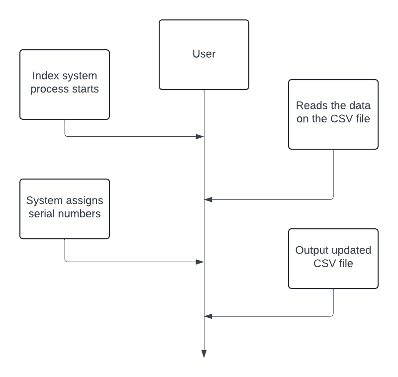

Here is the use case diagram for the index system, its very similar to the other use case diagram where all of the features are included within the entire process when the user starts it. These diagrams have the benefit of helping to understand the program a lot better by simplifying the entire process.

## Pseudocode Designs

### Problem 1 Pseudocode

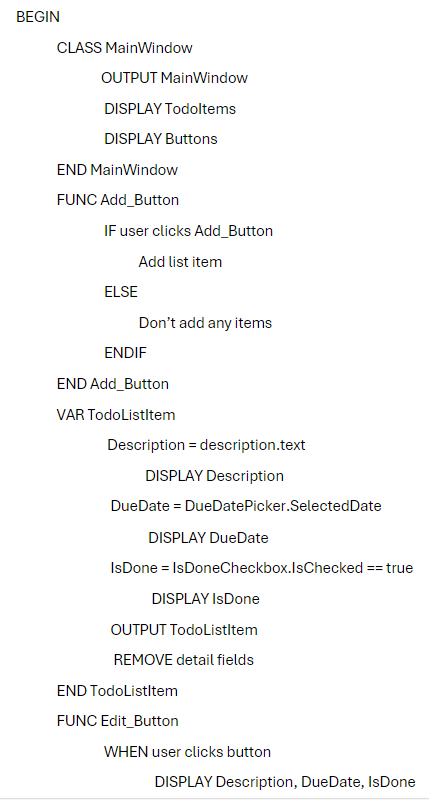

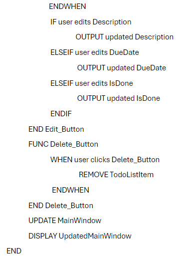

### Problem 2 Pseudocode

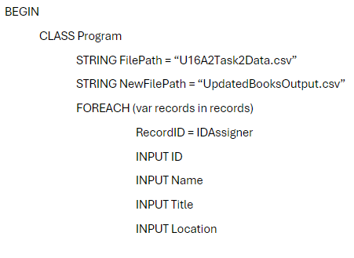

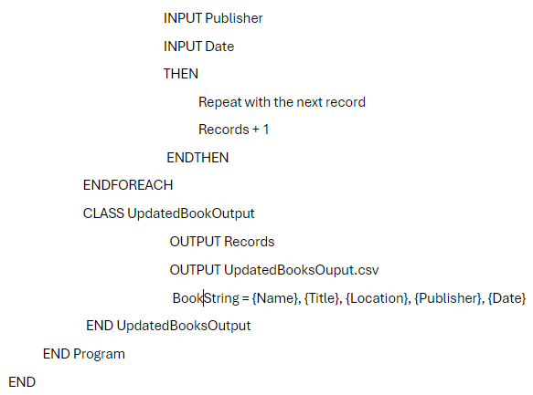

## GUI Design + Justifications

Using Canva, I created a mockup design of what I want the GUI of the todo list too look like:

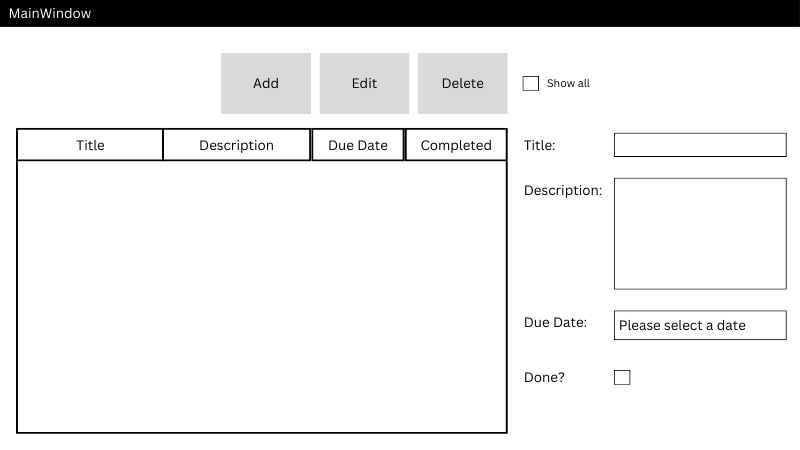

For the todo list I decided to use WPF, I decided to use WPF because of the design options it provides you with when creating the GUI. This will allow me to make the GUI more visually appealing, plus programming the visuals on WPF are more simple to understand than HTML/CSS, this will allow me to enhance the GUI in terms of design and functionality which can lead to the todo list being easy for users to use which would showcase great usability.

### Problem 2 Design Justifications

For the index system, I decided to use the external library CSVHelper since it makes reading and writing files so much more simple, plus it is also very flexible and easy to understand and use. I also decided to add other libraries such as "System.Security.Cryptography" because this will promote the overall security by using security methods such as hashing to do so, this will ensure the confidentiality and integrity of the code.
