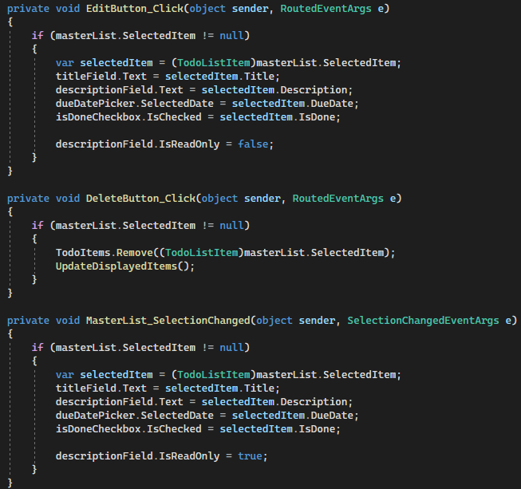
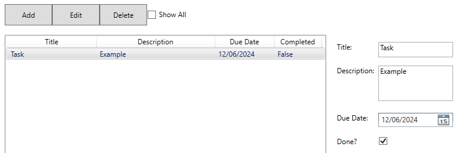

# U16A2 Development Phase

## Program Solutions

### Problem 1

For the todo list I created the todo lists GUI with WPF on visual studio, this is where I could eit the visuals a lot more effectively in order to make the todo list visually appealing and organize everything in ay to make it easy for users to understand.

Here is the code for the todo list GUI:

After that stage I would then move onto programming the functions of the todo list such as the buttons and checkboxes. I would use C# to program this and I would try to use the simplest methods possible to make my code easier to understand.

Here are images of the finished code:

### Problem 2

For the index system I would make this program with C# also on visual studio. Here are some images of the code for the index system:

## Test Plans

In this section I tested both solutions to problem one and two for functionality, usability, stability and performance.

### Problem 1 Tests

Here is the test plan for the todo list:

#### Add Button and Task Details Test:

Here I would test the add button to see if tasks get added with the details entered by the user to also test if the tasks get displayed with the details the user enters in. Here is an image of me testing this:

As we can see, the task gets added after clicking on the add button with the details that the user enters. This showcases great functionality since the add button works exactly as users would expect it to where they can add tasks with the details they entered.

#### Delete Button Test:

Here I would test the delete button to see if a selected task gets deleted after pressing the delete button. Here are some images of me testing this:

Here I selected the task I wanted to delete.

Here is the task getting deleted from the list.

As we can see the delete button deletes the task selected by he user after clicking it. This highlights not only great functionality but also usability since it doesn't just delete a random task, instead it deletes the task the user selected which makes the todo list easier to use.

#### Description Editing Test:

Here I would test to see if the user can edit the description of tasks. I would do this by clicking on the task I want to edit, click edit and then change the description and then click add. Here are images of me testing this:

As we can see, the description was originally "Example" and I then changed it to "Example 2" and it would then be displayed as this after I had clicked add. It would turn out the date can also be edited after already adding a task with a due date. This partially showcases good stability since the users are able to edit the description and due date without getting any errors but this sin't the case for editing the title and completion status, instead users would have to delete the task and create a new one which isn't a great example of good usability, this part would definitely need improving in future.

#### Task Status Test:

Here I would test the task status by seeing if tasks get shown as incomplete or complete. I would do this by adding a task that is incomplete and then edit it to say it is complete. Here are some images of me testing this:

As we can see, tasks do get displayed if they are incomplete, but they do not get displayed if they are marked as completed. This isn't exactly an issue since tasks wouldn't really need to be displayed if they're already completed as they wouldn't be priority anymore. This showcases good stability as there isn't any errors whilst trying to perform this and this also showcases good performance since there are no delays and they get added straight away which is time saving for users.

### Problem 2 Tests

Here is the test plan for the index system:

#### CSV File Is Read:

Firstly, I would test the index system by running it and checking to see if the original CSV file is read correctly. Here is the test result of this test:

As we can see the CSV file gets read correctly and accurately calculates how many lines and records there are. This showcases great functionality and performance since the index system was able to give an instant and accurate result.

#### Updated CSV File:

Secondly, I would search through the files of this index system to see if the updated CSV file got created which contains the books and their details. Here is an image of the result:

As we can see, the update CSV file called "UpdatedBooksOutput.csv" was created in net7.0 folder under the debug folder. This showcases great functionality and usability since the updated file can be created in any folder location for the user to view.

#### CSV File Content:

After that I would then open the updated CSV file to see if the books and their details were displayed correctly. Here is an image of the books with their details:

As we can see, the index system was able to correctly display all of the books and the book details in the order the program says. The all include an ID, title, author name, publisher, location and publication date. This showcases great stability since the index system was able to output all of this data without running into any issues whilst also performing this reasonably quickly.