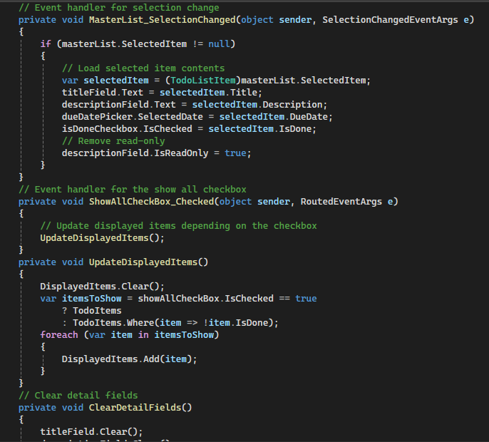

# U16A2 Evaluation Phase

## Personal Review

Personally, I believe the two solutions overall do showcase great functionality, stability, usability and performance, I also believe the solutions meet the requirements from the brief since they are proven to work as expected due to the results of the testing. The chosen libraries in both programs make the solutions more efficient for their specific purposes. The output of both solutions are well presented and easy to understand for users, the GUI of the todo list is professional and not complicated for users, the book details in the CSV file are organized in a simple and consistent fashion.

Although both solutions provide a number of benefits, I do believe there are a couple of potential improvements I could make. Firstly, the todo list allows the task description and due date to be edited but it doesn't allow the title or task status to be changed after it has already been added to the list. This doesn't showcase great functionality and stability so it would definitely be beneficial to make some tweaks on this part of the todo list so users can also edit the title and task status of an already existing task. Secondly, I also think it would be beneficial to add comments in the code for both solutions since it will increase the readability and make editing the code a lot easier since each section will be described by the added comments.

Overall, I believe the pros of the solutions significantly outweigh the cons of them and they are highly suitable for their intended purposes. In future, I will definitely make sure to make those two improvements to ensure both solutions are highly maintainable and stable.

## User Feedback

To ensure that I could find potential improvements that could be made to either solutions I reviewed the solutions with others to try and identify some.  

### 1st Feedback

In this piece of feedback they also believe it would be a great ideas to add comments to the programs for both solutions. As said before, I agree this change would be beneficial since it would help anyone editing the code since the comments are explaining what each part of the code is used for.

Here is this change being made to both solutions:

#### Todo List

#### Index System

### 2nd Feedback

In this piece of feedback it says that it would be beneficial to include the library called "System.Collections.Generic". I agree with this piece of feedback for the same reason it mentions, it would be beneficial because this library would provide type safety and it is used for storing key pairs and functionality. In conclusion, it is great for efficiently storing and manipulating value types. This library would definitely be beneficial for the index system since it would support LINQ (Language Integrated Query) integration which can be used to preform complex queries and transformations on the collections.

Here is an image of this change being made to the index system:

## Evaluation

Overall, I believe both of my solutions meet the requirements set by the brief. Whilst planning and creating these solutions I have made a number of decisions and I believe they were mostly great decisions. Firstly, I believe the chosen libraries for the index system were well picked because they all help in the reading and writing of CSV files, plus the "System.Security.Cryptography" library also promotes the security of the program since it allows the program to assign unique IDs to every book in the collection. Secondly, I believe choosing the todo list to be a WPF application was a great choice because the GUI would be more styled than on a console app since with WPF the GUI is styled with XAML which allows for more visually pleasing designs.

I believe the improvements made which were based off the user feedback were great additions due to the reasoning of implementing them. The comments will make the editing of the code a lot more easier for me and others especially, this is because the comments make the code a lot more easier to understand because the comments will explain the purpose of different parts within the code. The addition of the "System.Collections.Generic" library was also a great choice because of how much better it is at effectively organizing and modifying comparable data.

In conclusion, I believe my two solutions meet the requirements of the brief very well and they showcase great functionality, stability, performance and usability. Ever since the improvements have been made my code also now has great readability, maintainability and is able to store and manage data more effectively.